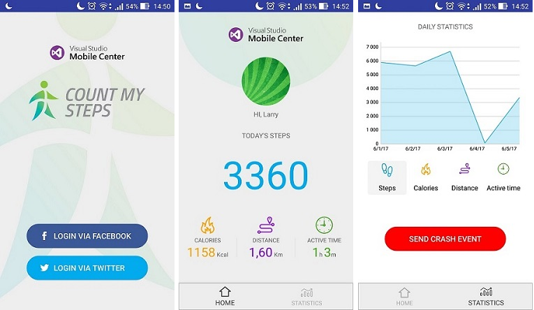

Pedometer. Demo application (Android native).
===================

This is demo application which shows ablities of Mobile Center.

Mobile Center brings together multiple services, commonly used by mobile developers, into a single, integrated product. 
Team members can build, test, distribute, and monitor mobile apps. 
The Demo Application intended to represent the features of the Mobile Center API, 
such as managing cross platform applications and collecting statistics about how application behaves on real users’ devices, 
what kind of crashes occurred and so on. Applications were integrated with social services like Twitter and Facebook, and use Google Fit (Health Kit) to show daily data of user’s activity.
